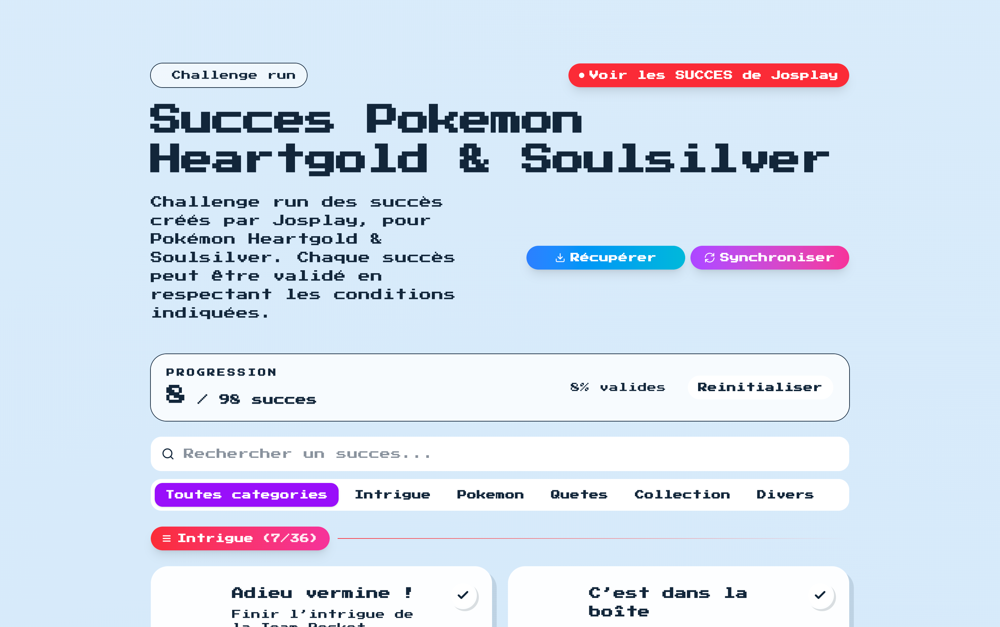

<h1 align="center">🧩 Succès Dex</h1>
<p align="center">Track the Josplay HeartGold & SoulSilver challenge run with a pixel-perfect, shareable progress companion.</p>
<p align="center">
  <a href="https://www.typescriptlang.org/"></a>
  <a href="https://nextjs.org/"></a>
  <a href="https://tailwindcss.com/"></a>
  <a href="https://www.prisma.io/"></a>
  <a href="https://succes-dex.com"></a>
  <a href="./LICENSE"></a>
</p>
<p align="center"><a href="https://succes-dex.com">succes-dex.com</a></p>



## Introduction 🎯
Succès Dex est le compagnon moderne qui transforme les succès de Josplay pour Pokémon HeartGold & SoulSilver en une expérience interactive, accessible et partageable. Built for developers who care about simplicity, performance, and clarity.

---

## Table of Contents 📚
- [Features ✨](#features-)
- [Installation 🧰](#installation-)
- [Usage 🚀](#usage-)
- [Architecture 🏗️](#architecture-)
- [Tech Stack 🧠](#tech-stack-)
- [Contributing 🤝](#contributing-)
- [Roadmap 🗺️](#roadmap-)
- [License ⚖️](#license-)
- [Acknowledgments 🙏](#acknowledgments-)

---

## Features ✨
- 🎯 Cartes de succès interactives avec progression en temps réel, confettis et accessibilité clavier.
- 🔍 Recherche instantanée, filtres par statut et catégories dynamiques alimentées par `public/successes.json`.
- 🔄 Synchronisation cloud bidirectionnelle via API Next.js, Prisma et support Neon/Postgres.
- 💾 Persistance locale SSR-safe grâce à un hook `useLocalStorage` typé qui écoute les événements multi-onglets.
- 🛡️ Authentification Basic sécurisée pour protéger la progression partagée côté serveur.
- 🧭 Tableau de bord responsive optimisé Tailwind v4 et animations Press Start 2P pour une ambiance rétro.

---

## Installation 🧰
1. **Cloner et installer**
   ```bash
   git clone https://github.com/P4ST4S/pokemon-success-josplay.git
   cd pokemon-success-josplay
   pnpm install
   ```
2. **Configurer les secrets**
   ```bash
   cp .env .env.local
   # Renseignez DATABASE_URL, ADMIN_USERNAME, ADMIN_PASSWORD
   ```
3. **Initialiser la base**
   ```bash
   pnpm prisma migrate deploy
   ```
4. **Lancer le mode dev**
   ```bash
   pnpm dev
   ```
5. **Visiter l'application** → http://localhost:3000

---

## Usage 🚀
**Quick start**
```tsx
import successes from "@/public/successes.json";
import { AchievementsGrid } from "@/components/achievements-grid";

<AchievementsGrid achievements={successes} />;
```
- Cochez les succès pour enregistrer votre progression instantanément dans le navigateur.
- Utilisez la barre de recherche, les filtres de statut ou de catégorie pour garder le cap.

**Advanced usage**
```bash
# Synchroniser depuis un terminal (exemple)
curl -X POST https://succes-dex.com/api/sync \
  -u "<ADMIN_USERNAME>:<ADMIN_PASSWORD>" \
  -H "Content-Type: application/json" \
  -d '{"completedIds":["elite-four","johto-dex","red-battle"]}'
```
- Ajoutez de nouveaux succès en enrichissant `public/successes.json` (structure typée via `types/achievement.ts`).
- Déployez sur Vercel : la CI exécute `pnpm install`, `pnpm prisma generate`, `pnpm build` automatiquement.

---

## Architecture 🏗️
```text
app/
  ├─ page.tsx           # Landing + Sync CTA
  ├─ api/               # Routes REST pour sync/progress
components/
  ├─ achievement-card   # Cartes interactives + animation confetti
  ├─ achievements/      # Header, filtres, dividers, empty state
  └─ sync-button.tsx    # Auth modal + actions sync/fetch
hooks/
  ├─ useLocalStorage    # Persistance SSR-safe
  ├─ useAchievement*    # Stats, filtres, animations
lib/prisma.ts           # Client Prisma instancié une seule fois
public/successes.json   # Source de vérité des succès (déployée statiquement)
prisma/schema.prisma    # Modèle Postgres (users + user_progress)
```
- Separation of concerns stricte : UI légère, logique dans les hooks, données dans config/types.
- Synchronisation sécurisée avec contraintes d'unicité Prisma et clean-up automatique.

---

## Tech Stack 🧠
- 🟦 TypeScript — Typage strict des composants, hooks et JSON.
- ⚙️ Next.js 16 App Router — Rendus full-stack, API Routes et métadonnées automatiques.
- 🎨 Tailwind CSS v4 — Design system rétro Pokémon + tokens personnalisés.
- 🧰 Prisma ORM — Accès Postgres multi-environnements avec migrations 2025-ready.
- 🪄 React 19 — Server Components + transitions client fluides.
- ☁️ Vercel & Neon — Déploiement instantané et base managée compatible edge.

---

## Contributing 🤝
1. Forkez le dépôt puis créez une branche feature : `git checkout -b feat/new-achievement`.
2. Suivez nos guidelines (formatage, convention de commit) décrites dans `SYNC_GUIDE.md`.
3. Ajoutez des tests ou des captures quand vous touchez au rendu.
4. Ouvrez une Pull Request en détaillant l'impact utilisateur et les points de vérification.
5. La revue inclut lint (`pnpm lint`) et tests de sync manuels via les routes API.

---

## Roadmap 🗺️
1. [ ] Mode multi-profils avec partage public sécurisé.
2. [ ] Export/Import JSON des succès hors-ligne.
3. [ ] Vue mobile dédiée avec navigation par gestes.
4. [ ] Dashboard analytics pour les streams Josplay.
5. [x] Synchronisation cloud chiffrée via Prisma.

---

## License ⚖️
Distribué sous licence [MIT](./LICENSE). 

---

## Acknowledgments 🙏
- [Josplay](https://www.youtube.com/@josplay012) pour la création des succès originaux HeartGold & SoulSilver.
- Communauté Pokémon francophone pour les retours UX et accessibilité.
- Prisma & Neon pour leur tooling developer-first qui facilite la sync cloud.

---

Made with ❤️ by Pastas — MIT License
